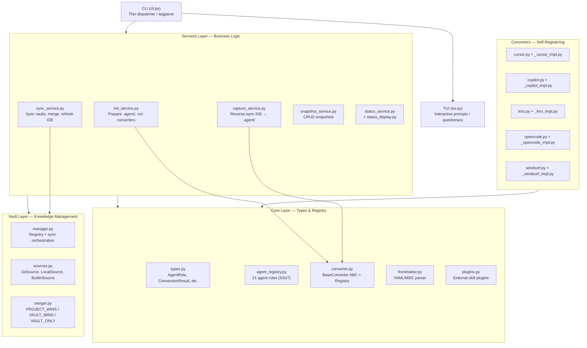
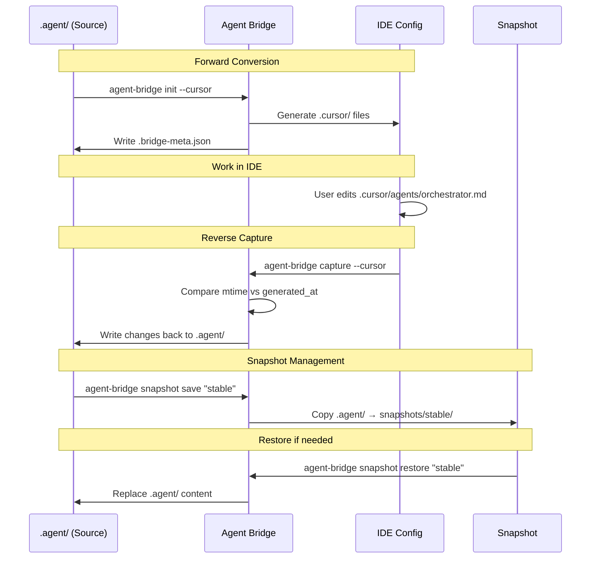

## EXECUTIVE SUMMARY

Agent Bridge is a high-quality Python CLI project with a clear architecture, adhering to the Open/Closed Principle through a self-registering converter system. The current codebase has 137 passing tests, supporting 5 IDEs (Cursor, Copilot, Kiro, OpenCode, Windsurf) with bidirectional synchronization capabilities for 3 of them. Key strengths include the Central Agent Registry as a single source of truth for 21 agent roles, a multi-source knowledge vault management system, and a completely declarative JSON-based plugin system. Recent improvements focus on UX (spinners, accessibility, NO_COLOR support) and expanded agent definitions. Current documentation is comprehensive but needs updates to reflect new features like the status dashboard, conflict resolution strategies, and pre-flight validation.

---

# Agent Bridge

> Universal converter for AI agent configurations — bidirectional synchronization between the standardized `.agent/` format and specific IDE configurations.

[](https://www.python.org/downloads/)
[](LICENSE)
[](#testing)
[](#accessibility)

---

## Table of Contents

- [Problem Solved](#problem-solved)
- [Quick Start](#-quick-start)
- [System Architecture](#system-architecture)
- [Supported IDEs](#supported-ides)
- [Command Reference](#command-reference)
- [Bidirectional Sync Workflow](#bidirectional-sync-workflow)
- [Knowledge Vaults](#knowledge-vaults)
- [Snapshot System](#snapshot-system)
- [MCP Integration](#mcp-integration)
- [Plugin System](#plugin-system)
- [Central Agent Registry](#central-agent-registry)
- [Detailed Configuration](#detailed-configuration)
- [Development Guide](#development-guide)
- [Testing](#testing)
- [Troubleshooting](#troubleshooting)
- [Contributing](#contributing)
- [License](#license)

---

## Problem Solved

Every AI IDE (Cursor, GitHub Copilot, Kiro, OpenCode, Windsurf) uses its own configuration format for AI agents. When developing with multiple IDEs, you must manually copy and maintain synchronization between these configuration files — a tedious and error-prone process.

Agent Bridge solves this by providing a **single source of truth** (the `.agent/` directory) and automatically converting it into the native format of each IDE. More importantly, it supports **reverse synchronization** — capturing changes you make directly in the IDE and bringing them back to `.agent/`.

```

.agent/ (Source of Truth)
├── agents/*.md
├── skills/*/SKILL.md
├── workflows/*.md
├── rules/*.md
└── mcp_config.json
│
▼ agent-bridge init --all
┌─────────────────────────────────────┐
│ .cursor/ .github/ .kiro/ │
│ .opencode/ .windsurf/ │
└─────────────────────────────────────┘
│
▼ agent-bridge capture --all
.agent/ (Updated back)

```

**Key Features:**

- **Forward Conversion**: `.agent/` → 5 specific IDE formats
- **Reverse Capture**: IDE → `.agent/` (Cursor, Kiro, Copilot)
- **Snapshot Management**: Store and restore `.agent/` states
- **Knowledge Vaults**: Register multiple knowledge sources (git repos, local directories, builtin)
- **MCP Integration**: Distribute Model Context Protocol configurations
- **Plugin System**: Install external skills via JSON declaration
- **Interactive TUI**: Built with questionary, supports adaptive colors
- **Accessibility**: WCAG 2.1 AA compliant, NO_COLOR support, screen reader friendly

---

## 🚀 Quick Start

### Installation

```bash
# From GitHub (recommended)
pipx install git+https://github.com/HaoNgo232/agent-bridge

# From source (development)
git clone https://github.com/HaoNgo232/agent-bridge.git
cd agent-bridge
pip install -e ".[dev]"

# Or using make
make setup
```

**Requirements:** Python 3.8+, Git (for vault sync), Node.js/npm (optional, for plugins)

### Basic Usage (< 2 minutes)

```bash
cd your-project

# Step 1: Initialize — The interactive TUI will guide you
agent-bridge init

# Or specify directly
agent-bridge init --cursor --kiro

# Or all IDEs at once
agent-bridge init --all

# Step 2: Verification
agent-bridge status

# Step 3: After editing in IDE, sync back
agent-bridge capture --cursor
```

After running `agent-bridge init --cursor`, your project structure will look like this:

```
your-project/
├── .agent/                    # Source of Truth (manually created or from vault)
│   ├── agents/orchestrator.md
│   ├── skills/clean-code/SKILL.md
│   ├── workflows/plan.md
│   ├── rules/global.md
│   ├── mcp_config.json
│   └── .bridge-meta.json      # Automatically created, tracks generated files
├── .cursor/                   # Automatically generated by Agent Bridge
│   ├── agents/orchestrator.md
│   ├── rules/clean-code.mdc
│   ├── skills/plan/SKILL.md
│   └── mcp.json
└── ... (your project code)
```

---

## System Architecture

### Layered Overview



### Key Design Decisions

**1. Self-Registering Converters (Open/Closed Principle)**

Each converter registers itself with the `ConverterRegistry` at import time. When Python loads `src/agent_bridge/converters/__init__.py`, it imports all converter modules, triggering their registration. Adding a new IDE only requires creating 2 files — no changes to services, CLI, or utils are needed.

```python
# src/agent_bridge/converters/__init__.py
from . import copilot   # triggers CopilotConverter registration
from . import cursor
from . import kiro
from . import opencode
from . import windsurf
```

Each converter ends with:

```python
# src/agent_bridge/converters/cursor.py
converter_registry.register(CursorConverter)
```

**2. Central Agent Registry — Single Source of Truth**

`src/agent_bridge/core/agent_registry.py` defines 21 agent roles with full capabilities (read/write/execute/search), allowed commands, allowed paths, subagents, and handoff targets. All converters query this registry instead of maintaining their own maps.

```python
# src/agent_bridge/core/agent_registry.py
AgentRole(
    slug="orchestrator", name="Orchestrator",
    description="High-level coordinator for complex, multi-step tasks",
    can_read=True, can_write=False, can_execute=False, can_search=True,
    can_delegate=True, delegatable_agents=["*"],
    category="primary",
    subagents=["*"],
    handoff_targets=["frontend-specialist", "backend-specialist", ...],
)
```

Benefit: Add a new agent role once, and all 5 converters automatically receive it. The `validate_agent_references()` function ensures reference integrity.

**3. Bridge Meta Tracking**

When `agent-bridge init` runs, `init_service._write_bridge_meta()` writes `.agent/.bridge-meta.json`, mapping each generated IDE file back to its source file in `.agent/`. The capture service uses this metadata to distinguish between new files (created by the user in the IDE), modified files (mtime > generated_at), and unchanged files.

**4. Service Layer Separation**

All business logic resides in `services/`, completely decoupled from CLI parsing and TUI prompts. Tests call services directly without needing to simulate CLI invocations.

**5. Strategy Pattern for Vaults**

`vault/sources.py` implements 3 strategies: `GitSource` (clone/pull repo), `LocalSource` (symlink-free reference), and `BuiltinSource` (starter vault included with the package). Each source knows how to sync and validate itself.

---

## Supported IDEs

| IDE            | Output Directory | Output Format                  | Reverse Capture | Status |
| -------------- | ---------------- | ------------------------------ | --------------- | ------ |
| Cursor AI      | `.cursor/`       | Markdown + MDC rules           | Yes             | Beta   |
| GitHub Copilot | `.github/`       | YAML frontmatter markdown      | Yes             | Beta   |
| Kiro CLI       | `.kiro/`         | JSON agents + markdown prompts | Yes             | Beta   |
| OpenCode       | `.opencode/`     | YAML frontmatter + JSON config | No              | Beta   |
| Windsurf       | `.windsurf/`     | Markdown with activation modes | No              | Beta   |

### Format Details

**Cursor** (`src/agent_bridge/converters/_cursor_impl.py`): Agents → `.cursor/agents/*.md` with name/description frontmatter. Skills are categorized as MDC rules (`.cursor/rules/*.mdc` with `alwaysApply`/`globs` for auto-attach) or slash-command skills (`.cursor/skills/*/SKILL.md` for on-demand). Categorization is based on the `MDC_RULES_CONFIG` map and `core/skill_metadata.py` registry. Workflows → skills. Automatically creates `project-instructions.mdc` from `AGENTS.md` if present.

**Copilot** (`src/agent_bridge/converters/_copilot_impl.py`): Agents → `.github/agents/*.agent.md` with full YAML frontmatter. Tools are derived from AgentRole capabilities via `_role_to_copilot_tools()`. Subagents and handoff prompts are pulled from the Central Agent Registry. Skills → `.github/skills/*/SKILL.md`. Workflows → `.github/prompts/*.prompt.md`. Rules → `.github/instructions/*.instructions.md`. Agent bodies are truncated at 30K characters per Copilot limits.

**Kiro** (`src/agent_bridge/converters/_kiro_impl.py`): Agents → `.kiro/agents/*.json` per Kiro CLI official spec — including tools, allowedTools (auto-approve), toolsSettings (allowedCommands, allowedPaths), hooks (agentSpawn lifecycle), resources (file:// URIs), and includeMcpJson. MCP server names are auto-trusted via the `@server_name` pattern. Skills → directly copied. Workflows → `.kiro/prompts/*.md` with Kiro template syntax (`{{args}}`). Rules → `.kiro/steering/*.md` with `inclusion: always` frontmatter.

**OpenCode** (`src/agent_bridge/converters/_opencode_impl.py`): Agents → `.opencode/agents/*.md` with frontmatter for mode (primary/subagent), tools, and permissions. MCP config is embedded directly into `opencode.json` instead of a separate file — this is OpenCode's specific behavior. Workflows → `.opencode/commands/*.md`. Skills → directly copied. Generates `opencode.json` with schema, instructions globs, and default_agent.

**Windsurf** (`src/agent_bridge/converters/_windsurf_impl.py`): All (agents, skills, workflows) → `.windsurf/rules/*.md` with activation modes (Always On, Glob, Model Decision, Manual). Skills are categorized via `SKILL_ACTIVATION_MAP`. Workflows extract steps from markdown. Per-rule limit of 12,000 characters, truncated if exceeded. Generates a legacy `.windsurfrules` root file from always-on skills + project instructions.

---

## Command Reference

### `agent-bridge init` — Initialize Configuration

```bash
agent-bridge init                    # Interactive TUI (recommended)
agent-bridge init --cursor           # Cursor only
agent-bridge init --kiro --copilot   # Multiple IDEs
agent-bridge init --all              # All 5 IDEs
agent-bridge init --from my-snapshot # Initialize from a saved snapshot
agent-bridge init --force            # Overwrite without asking
agent-bridge init --no-interactive   # Skip TUI
```

**Pre-flight Validation**: When running in CLI mode (non-TUI), the system checks if IDE configurations already exist before performing conversion. If they exist without `--force`, it provides an actionable error instead of silently overwriting.

**Processing Flow** (`src/agent_bridge/services/init_service.py`):

1. Source handling: `project` (local `.agent/`), `vault` (fetch from vault), `merge` (merge vault + project), `snapshot` (from saved state)
2. Run converter for each selected IDE
3. Install MCP configuration
4. Write `.bridge-meta.json` for tracking

### `agent-bridge capture` — Reverse Synchronization

```bash
agent-bridge capture                              # Interactive TUI
agent-bridge capture --cursor                     # From Cursor only
agent-bridge capture --all                        # From all supported IDEs
agent-bridge capture --strategy ide_wins          # IDE changes take precedence
agent-bridge capture --strategy agent_wins        # Keep current .agent/
agent-bridge capture --strategy smart             # Automated decision (default)
agent-bridge capture --dry-run                    # Preview only, no writes
```

**Smart Strategy**: Analyzes file status to choose the optimal strategy. If more files are NEW than MODIFIED → `ide_wins`. Otherwise, captures MODIFIED and NEW while skipping UNCHANGED.

**Capture Preview**: Shows a diff summary (lines added/removed) and requests confirmation before writing.

### `agent-bridge update` — Sync and Refresh

```bash
agent-bridge update                  # Sync vaults + refresh IDE configs
agent-bridge update --target .agent  # Specify target directory
```

**Processing Flow** (`src/agent_bridge/services/sync_service.py`):

1. Auto-snapshot safety net — saves `auto-pre-update` before changes
2. Sync all vault sources
3. Merge into project `.agent/` (PROJECT_WINS strategy)
4. Copy config files if missing
5. Auto-refresh IDE configs detected in the project

### `agent-bridge snapshot` — Version Management

```bash
agent-bridge snapshot save my-snap -d "Description"      # Save
agent-bridge snapshot save tagged -t "lang:dart"         # Save with tags
agent-bridge snapshot list                               # List (newest first)
agent-bridge snapshot info my-snap                       # Details
agent-bridge snapshot restore my-snap                    # Restore
agent-bridge snapshot delete my-snap                     # Delete (with confirmation)
```

Snapshots are stored at `~/.config/agent-bridge/snapshots/<name>/` with atomic writes. Saving with the same name automatically increments the version.

### `agent-bridge status` — Dashboard

```bash
agent-bridge status          # Formatted dashboard
agent-bridge status --json   # JSON for scripts/CI
```

Example output:

```
📊 Agent Bridge Dashboard
📍 Project: /home/user/my-project

📈 Summary: 21 agents • 35 skills • 1 vaults • 3 IDEs

📦 Source:  .agent/ (58 items — agents: 21, skills: 35, workflows: 1, rules: 1)
🔗 Vaults (1 active):
   ✓ Synced (1): antigravity-kit
🖥  IDEs (3 initialized):
   ✓ cursor     .cursor/        (45 files)
   ⚠ kiro       .kiro/          (120 files) (stale — run 'agent-bridge update')
   ✓ copilot    .github/        (25 files)
   ✗ Not initialized: opencode, windsurf
🔌 MCP: .agent/mcp_config.json (2 servers: github, filesystem)

🧭 Recommended next steps:
  • Run 'agent-bridge update' to refresh IDE configs
```

### `agent-bridge vault` — Knowledge Vault Management

```bash
agent-bridge vault list                                     # List vaults
agent-bridge vault add my-team git@github.com:org/repo.git  # Add Git vault
agent-bridge vault add local /path/to/agents -p 50          # Add local vault (priority 50)
agent-bridge vault remove my-team                           # Remove vault
agent-bridge vault sync                                     # Sync all vaults
agent-bridge vault sync --name my-team                      # Sync specific vault
```

### `agent-bridge mcp` — Install MCP Configuration

```bash
agent-bridge mcp --all               # All IDEs
agent-bridge mcp --cursor --kiro     # Specific IDEs
agent-bridge mcp --force             # Overwrite existing
```

### `agent-bridge clean` — Remove IDE Configs

```bash
agent-bridge clean --all             # Remove all (with preview + confirmation)
agent-bridge clean --cursor          # Remove Cursor config
agent-bridge clean --cursor --force  # Skip confirmation
```

### `agent-bridge list` — IDE Formats

Lists all 5 supported IDE formats with their status.

### Direct Conversion (Backward Compatibility)

```bash
agent-bridge cursor --source .agent
agent-bridge kiro --source .agent
agent-bridge copilot
```

---

## Bidirectional Sync Workflow



### Bridge Meta Engine

`.agent/.bridge-meta.json` is created after each `init`, containing:

```json
{
  "generated_at": "2026-03-26T14:12:36Z",
  "generated_for": ["cursor", "kiro"],
  "file_map": {
    ".cursor/agents/orchestrator.md": ".agent/agents/orchestrator.md",
    ".cursor/rules/clean-code.mdc": ".agent/skills/clean-code/SKILL.md",
    ".kiro/agents/orchestrator.json": ".agent/agents/orchestrator.md"
  }
}
```

The capture service uses `file_map` and `generated_at` to categorize:

- **new**: File not found in `file_map` (created by user in IDE)
- **modified**: File in `file_map` and `mtime > generated_at`
- **unchanged**: File in `file_map` and not modified

---

## Knowledge Vaults

A vault is any directory containing a `.agent/` structure:

```
vault-repo/
└── .agent/
    ├── agents/*.md
    ├── skills/*/SKILL.md
    ├── workflows/*.md
    ├── rules/*.md
    ├── mcp_config.json
    └── plugins.json
```

### Vault Types

| Type    | Class           | Description                                |
| ------- | --------------- | ------------------------------------------ |
| Git     | `GitSource`     | Clone/pull from a remote repository        |
| Local   | `LocalSource`   | Direct reference from a local path         |
| Builtin | `BuiltinSource` | Starter vault included with the package    |

### Merge Priority

When multiple vaults exist, files are merged in this order:

1. **Project-local files** — highest priority
2. **Vaults by priority** — lower number = higher priority
3. Merge strategies: `PROJECT_WINS` (default), `VAULT_WINS`, or `VAULT_ONLY`

### Vault Security

URLs are validated via the `_SAFE_GIT_URL` regex — only `https://` and `git@` are accepted, preventing URLs starting with `-`. Symlinks are blocked from vault sources, and path traversal is prevented via resolution and startswith checks.

### Storage

Stored in `~/.config/agent-bridge/`:
- `vaults.json`: Vault registry
- `cache/`: Cached vault content
- `snapshots/`: Saved snapshots

---

## Snapshot System

Snapshots provide lightweight version control for the `.agent/` directory, independent of Git.

**Features:**

- **Atomic Write**: Writes to a temporary directory first, then renames — prevents corruption if interrupted.
- **Auto-versioning**: Saving with the same name increments the version automatically.
- **Tag Support**: Attach metadata like `framework:flutter` or `lang:dart`.
- **Content Manifest**: Automatically counts agents/skills/workflows/rules in the snapshot.

**Lifecycle Workflow:**

```bash
# 1. Save stable state
agent-bridge snapshot save "pre-refactor" -d "Before restructuring"

# 2. Experiment with changes...

# 3. If it breaks, restore
agent-bridge snapshot restore "pre-refactor"

# 4. Auto-snapshot on update
# run_update() automatically saves "auto-pre-update" before merging vaults
```

---

## MCP Integration

Agent Bridge distributes Model Context Protocol (MCP) configurations from `.agent/mcp_config.json` to IDE-specific locations and formats:

| IDE      | Output Path                           | Key Format              | Notes                               |
| -------- | ------------------------------------- | ----------------------- | ----------------------------------- |
| Copilot  | `.vscode/mcp.json`                    | `{"servers": {...}}`    | VS Code requires `servers` key      |
| Cursor   | `.cursor/mcp.json`                    | `{"mcpServers": {...}}` | Original format                     |
| Kiro     | `.kiro/settings/mcp.json`             | `{"mcpServers": {...}}` | Direct copy                         |
| OpenCode | Embedded in `.opencode/opencode.json` | Custom format           | Commands as arrays, adds `type`     |
| Windsurf | `.windsurf/mcp_config.json`           | `{"mcpServers": {...}}` | Original format                     |

Transformation logic resides in each converter's `transform_mcp_config()` method.

---

## Plugin System

Plugins allow installing external skills (npm packages, pip packages, etc.) via JSON declaration without writing Python code.

**Declaration** (`.agent/plugins.json`):

```json
{
  "plugins": [
    {
      "name": "ui-ux-pro-max",
      "description": "UI/UX design skill pack",
      "homepage": "https://github.com/...",
      "install": {
        "requires": "npm",
        "package": "uipro-cli",
        "global": true,
        "commands": {
          "kiro": "uipro init --ai kiro",
          "cursor": "uipro init --ai cursor"
        }
      },
      "condition": {
        "file_exists": ".agent/workflows/ui-ux-pro-max.md"
      },
      "prompt_before_install": true
    }
  ]
}
```

**Features:**
- **Declarative**: Defined in pure JSON, no code changes required.
- **Per-IDE**: IDE-specific commands.
- **Conditional**: Runs only if conditions are met.
- **Safe**: Prompts before global installations; includes a 180s timeout.

---

## Central Agent Registry

`src/agent_bridge/core/agent_registry.py` is the single source of truth for 21 agent roles:

### Agent Categories

| Category | Agents                                                              | Characteristics                      |
| -------- | ------------------------------------------------------------------- | ------------------------------------ |
| Primary  | orchestrator, frontend-specialist, backend-specialist               | can_write or can_delegate            |
| Subagent | project-planner, explorer-agent, security-auditor, test-engineer... | Specialized tasks, invoked by others |
| Internal | code-archaeologist                                                  | hidden=True, not shown to user       |

### AgentRole Structure

Converters derive IDE-specific configs from `AgentRole` fields such as `slug`, `can_read`, `can_write`, `allowed_commands`, `subagents`, and `handoff_targets`.

---

## Detailed Configuration

### Project Structure

```
your-project/
├── .agent/                    # Source of Truth — TRACK in Git
│   ├── agents/*.md            # Agent definitions
│   ├── skills/*/SKILL.md      # Skill packs
│   ├── workflows/*.md         # Workflow templates
│   ├── rules/*.md             # Global rules
│   ├── mcp_config.json        # MCP config
│   ├── plugins.json           # Plugins
│   └── .bridge-meta.json      # Generated tracking (DO NOT EDIT)
├── .cursor/                   # Generated
├── .github/                   # Generated
├── .kiro/                     # Generated
├── .opencode/                 # Generated
└── .windsurf/                 # Generated
```

### Environment Variables

- `NO_COLOR`: Disables ANSI color output.
- `SCREEN_READER`: Enables screen-reader friendly mode (simple spinners).
- `GITHUB_TOKEN`: For GitHub-related MCP servers.

---

## Development Guide

### Environment Setup

```bash
git clone https://github.com/HaoNgo232/agent-bridge.git
cd agent-bridge
make setup
```

### Code Style

- **Linter**: Ruff
- **Line Length**: 120 characters
- **Target Python**: 3.8
- **Type Hints**: Encouraged
- **Comments**: Clear and descriptive (Vietnamese in code, English in docs)

```bash
make lint      # Check
make format    # Auto-fix + format
make check     # Full check
```

---

## Testing

```bash
# Run all 137 tests
pytest tests/
```

Test categories include: converter end-to-end, reverse conversion, roundtrip (forward → reverse → compare), capture service, snapshot CRUD, vault merger, and plugin system.

---

## Troubleshooting

### "No .agent/ directory available"
Run `agent-bridge init` with a `vault` source or create it manually.

### Capture shows all files as "new"
`.agent/.bridge-meta.json` is missing. Re-run `agent-bridge init`.

### Stale IDE configs
Run `agent-bridge status` followed by `agent-bridge update`.

---

## License

MIT © HaoNgo232
