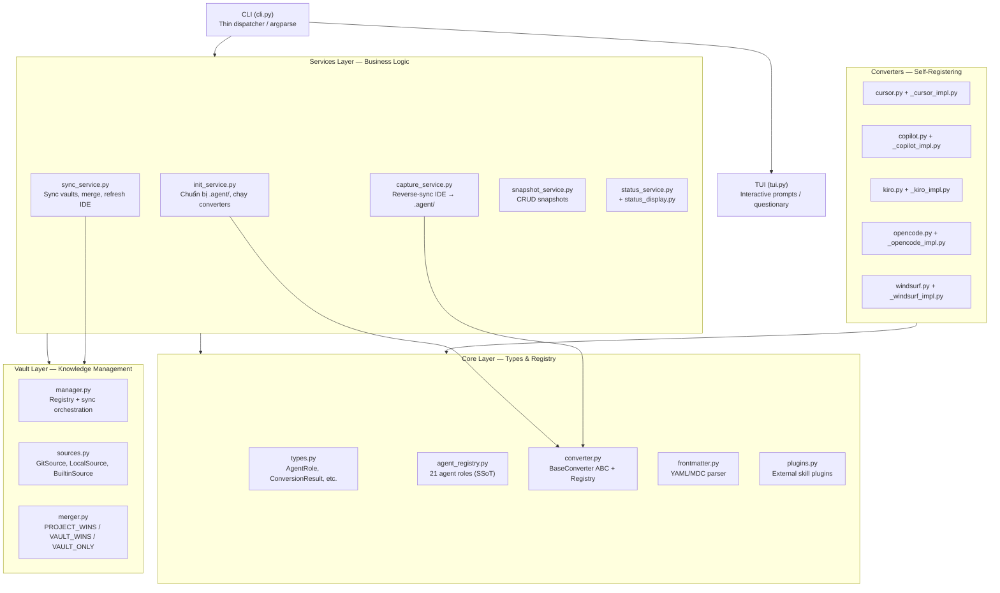
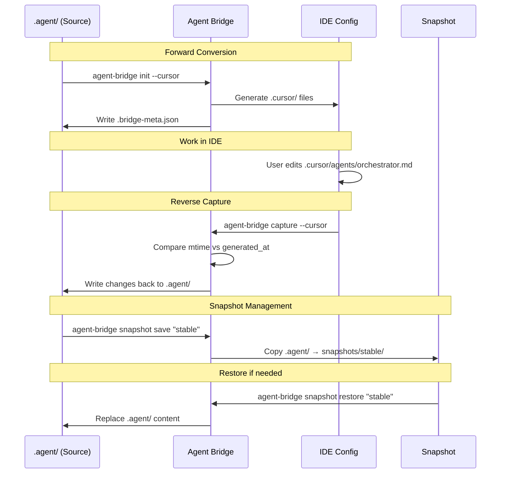

## EXECUTIVE SUMMARY

Agent Bridge là một dự án Python CLI chất lượng cao với kiến trúc rõ ràng, tuân thủ nguyên tắc Open/Closed Principle thông qua hệ thống converter tự đăng ký. Codebase hiện tại có 137 test đạt, hỗ trợ 5 IDE (Cursor, Copilot, Kiro, OpenCode, Windsurf) với khả năng đồng bộ hai chiều cho 3 trong số đó. Điểm mạnh nổi bật là Central Agent Registry làm single source of truth cho 21 agent roles, hệ thống vault quản lý kiến thức đa nguồn, và plugin system khai báo hoàn toàn qua JSON. Các cải tiến gần đây tập trung vào UX (spinner, accessibility, NO_COLOR support) và mở rộng agent definitions. Tài liệu hiện tại khá đầy đủ nhưng cần cập nhật để phản ánh các tính năng mới về status dashboard, conflict resolution strategies, và pre-flight validation.

---

# Agent Bridge

> Công cụ chuyển đổi đa năng cho cấu hình AI agent — đồng bộ hai chiều giữa định dạng `.agent/` chuẩn hóa và cấu hình riêng của từng IDE.

[](https://www.python.org/downloads/)
[](LICENSE)
[](#kiểm-thử)
[](#accessibility)

---

## Mục Lục

- [Vấn Đề Giải Quyết](#vấn-đề-giải-quyết)
- [Bắt Đầu Nhanh](#-bắt-đầu-nhanh)
- [Kiến Trúc Hệ Thống](#kiến-trúc-hệ-thống)
- [IDE Được Hỗ Trợ](#ide-được-hỗ-trợ)
- [Tham Chiếu Lệnh](#tham-chiếu-lệnh)
- [Quy Trình Đồng Bộ Hai Chiều](#quy-trình-đồng-bộ-hai-chiều)
- [Knowledge Vaults](#knowledge-vaults)
- [Hệ Thống Snapshot](#hệ-thống-snapshot)
- [Tích Hợp MCP](#tích-hợp-mcp)
- [Hệ Thống Plugin](#hệ-thống-plugin)
- [Central Agent Registry](#central-agent-registry)
- [Cấu Hình Chi Tiết](#cấu-hình-chi-tiết)
- [Hướng Dẫn Phát Triển](#hướng-dẫn-phát-triển)
- [Kiểm Thử](#kiểm-thử)
- [Xử Lý Sự Cố](#xử-lý-sự-cố)
- [Đóng Góp](#đóng-góp)
- [Giấy Phép](#giấy-phép)

---

## Vấn Đề Giải Quyết

Mỗi IDE AI (Cursor, GitHub Copilot, Kiro, OpenCode, Windsurf) sử dụng định dạng cấu hình riêng cho AI agent. Khi phát triển với nhiều IDE, bạn phải sao chép thủ công và duy trì đồng bộ giữa các file cấu hình — một quy trình dễ sai sót và tốn thời gian.

Agent Bridge giải quyết vấn đề này bằng cách cung cấp một **nguồn chân lý duy nhất** (thư mục `.agent/`) và tự động chuyển đổi sang định dạng gốc của từng IDE. Quan trọng hơn, nó hỗ trợ **đồng bộ ngược** — nắm bắt thay đổi bạn thực hiện trực tiếp trong IDE và đưa chúng trở lại `.agent/`.

```

.agent/ (nguồn chân lý)
├── agents/_.md
├── skills/_/SKILL.md
├── workflows/_.md
├── rules/_.md
└── mcp_config.json
│
▼ agent-bridge init --all
┌─────────────────────────────────────┐
│ .cursor/ .github/ .kiro/ │
│ .opencode/ .windsurf/ │
└─────────────────────────────────────┘
│
▼ agent-bridge capture --all
.agent/ (cập nhật ngược)

```

**Tính năng chính:**

- **Chuyển đổi xuôi** `.agent/` → 5 định dạng IDE cụ thể
- **Nắm bắt ngược** từ IDE → `.agent/` (Cursor, Kiro, Copilot)
- **Quản lý snapshot** lưu trữ và khôi phục trạng thái `.agent/`
- **Knowledge vaults** đăng ký nhiều nguồn kiến thức (git repo, thư mục local, builtin)
- **Tích hợp MCP** phân phối Model Context Protocol configuration
- **Plugin system** cài đặt skill bên ngoài qua khai báo JSON
- **TUI tương tác** với questionary, hỗ trợ adaptive colors
- **Accessibility** WCAG 2.1 AA, NO_COLOR support, screen reader friendly

---

## 🚀 Bắt Đầu Nhanh

### Cài đặt

```bash
# Từ GitHub (khuyến nghị)
pipx install git+https://github.com/HaoNgo232/agent-bridge

# Từ mã nguồn (phát triển)
git clone https://github.com/HaoNgo232/agent-bridge.git
cd agent-bridge
pip install -e ".[dev]"

# Hoặc dùng make
make setup
```

**Yêu cầu:** Python 3.8+, Git (cho vault sync), Node.js/npm (tùy chọn, cho plugin)

### Sử dụng cơ bản (< 2 phút)

```bash
cd your-project

# Bước 1: Khởi tạo — TUI tương tác sẽ hướng dẫn bạn
agent-bridge init

# Hoặc chỉ định trực tiếp
agent-bridge init --cursor --kiro

# Hoặc tất cả IDE cùng lúc
agent-bridge init --all

# Bước 2: Xác minh
agent-bridge status

# Bước 3: Sau khi chỉnh sửa trong IDE, đồng bộ ngược
agent-bridge capture --cursor
```

Sau khi chạy `agent-bridge init --cursor`, cấu trúc dự án sẽ trông như thế này:

```
your-project/
├── .agent/                    # Nguồn chân lý (bạn tạo hoặc từ vault)
│   ├── agents/orchestrator.md
│   ├── skills/clean-code/SKILL.md
│   ├── workflows/plan.md
│   ├── rules/global.md
│   ├── mcp_config.json
│   └── .bridge-meta.json      # Tự động tạo, theo dõi file đã generate
├── .cursor/                   # Tự động tạo bởi Agent Bridge
│   ├── agents/orchestrator.md
│   ├── rules/clean-code.mdc
│   ├── skills/plan/SKILL.md
│   └── mcp.json
└── ... (code dự án của bạn)
```

---

## Kiến Trúc Hệ Thống

### Tổng quan phân lớp



### Quyết định thiết kế quan trọng

**1. Self-Registering Converters (Open/Closed Principle)**

Mỗi converter tự đăng ký vào `ConverterRegistry` tại thời điểm import. Khi Python load `src/agent_bridge/converters/__init__.py` (dòng 7-11), nó import tất cả converter modules, kích hoạt registration. Thêm IDE mới chỉ cần tạo 2 file — không cần sửa bất kỳ service, CLI, hay utils nào.

```python
# src/agent_bridge/converters/__init__.py (dòng 7-11)
from . import copilot   # noqa: F401 — triggers CopilotConverter registration
from . import cursor     # noqa: F401
from . import kiro       # noqa: F401
from . import opencode   # noqa: F401
from . import windsurf   # noqa: F401
```

Mỗi converter kết thúc bằng:

```python
# src/agent_bridge/converters/cursor.py (dòng cuối)
converter_registry.register(CursorConverter)
```

**2. Central Agent Registry — Single Source of Truth**

`src/agent_bridge/core/agent_registry.py` định nghĩa 21 agent roles với đầy đủ capabilities (read/write/execute/search), allowed commands, allowed paths, subagents, và handoff targets. Tất cả converters đều truy vấn registry này thay vì duy trì bản đồ riêng.

```python
# src/agent_bridge/core/agent_registry.py (dòng 18-30)
AgentRole(
    slug="orchestrator", name="Orchestrator",
    description="High-level coordinator for complex, multi-step tasks",
    can_read=True, can_write=False, can_execute=False, can_search=True,
    can_delegate=True, delegatable_agents=["*"],
    category="primary",
    subagents=["*"],
    handoff_targets=["frontend-specialist", "backend-specialist", ...],
)
```

Lợi ích: Thêm agent role mới một lần, tất cả 5 converters tự động nhận. Hàm `validate_agent_references()` kiểm tra tính toàn vẹn tham chiếu.

**3. Bridge Meta Tracking**

Khi `agent-bridge init` chạy, `init_service._write_bridge_meta()` ghi `.agent/.bridge-meta.json` ánh xạ mỗi file IDE đã generate về file `.agent/` nguồn. Service capture dùng metadata này để phân biệt file mới (user tạo trong IDE), file đã sửa (mtime > generated_at), và file không đổi.

**4. Service Layer Separation**

Toàn bộ business logic nằm trong `services/`, hoàn toàn tách rời khỏi CLI parsing và TUI prompts. Tests gọi services trực tiếp, không cần mô phỏng CLI invocation.

**5. Strategy Pattern cho Vaults**

`vault/sources.py` triển khai 3 strategies: `GitSource` (clone/pull repo), `LocalSource` (symlink-free reference), `BuiltinSource` (vault starter đi kèm package). Mỗi source tự biết cách sync và validate.

---

## IDE Được Hỗ Trợ

| IDE            | Thư mục đầu ra | Định dạng output               | Capture ngược | Trạng thái |
| -------------- | -------------- | ------------------------------ | ------------- | ---------- |
| Cursor AI      | `.cursor/`     | Markdown + MDC rules           | Có            | Beta       |
| GitHub Copilot | `.github/`     | YAML frontmatter markdown      | Có            | Beta       |
| Kiro CLI       | `.kiro/`       | JSON agents + markdown prompts | Có            | Beta       |
| OpenCode       | `.opencode/`   | YAML frontmatter + JSON config | Không         | Beta       |
| Windsurf       | `.windsurf/`   | Markdown với activation modes  | Không         | Beta       |

### Chi tiết định dạng từng IDE

**Cursor** (`src/agent_bridge/converters/_cursor_impl.py`): Agents → `.cursor/agents/*.md` với name/description frontmatter. Skills được phân loại thành MDC rules (`.cursor/rules/*.mdc` với `alwaysApply`/`globs` frontmatter cho auto-attach) hoặc slash-command skills (`.cursor/skills/*/SKILL.md` cho on-demand). Phân loại dựa trên `MDC_RULES_CONFIG` hardcoded map và `core/skill_metadata.py` registry. Workflows → skills. Tự động tạo `project-instructions.mdc` từ AGENTS.md nếu có.

**Copilot** (`src/agent_bridge/converters/_copilot_impl.py`): Agents → `.github/agents/*.agent.md` với full YAML frontmatter (name, description, tools, agents, handoffs). Tools được derive từ AgentRole capabilities qua `_role_to_copilot_tools()`. Subagents và handoff prompts lấy từ Central Agent Registry. Skills → `.github/skills/*/SKILL.md`. Workflows → `.github/prompts/*.prompt.md`. Rules → `.github/instructions/*.instructions.md`. Body agent bị truncate ở 30K chars theo giới hạn Copilot.

**Kiro** (`src/agent_bridge/converters/_kiro_impl.py`): Agents → `.kiro/agents/*.json` theo Kiro CLI official spec — bao gồm tools, allowedTools (auto-approve), toolsSettings (allowedCommands, allowedPaths), hooks (agentSpawn lifecycle), resources (file:// URIs), và includeMcpJson. MCP server names được auto-trust qua `@server_name` pattern. Skills → copy trực tiếp. Workflows → `.kiro/prompts/*.md` với Kiro template syntax (`{{args}}`). Rules → `.kiro/steering/*.md` với `inclusion: always` frontmatter.

**OpenCode** (`src/agent_bridge/converters/_opencode_impl.py`): Agents → `.opencode/agents/*.md` với frontmatter mode (primary/subagent), tools, permission. MCP config được embed trực tiếp vào `opencode.json` thay vì file riêng — đây là hành vi đặc thù của OpenCode. Workflows → `.opencode/commands/*.md`. Skills → copy trực tiếp. Tự tạo `opencode.json` với schema, instructions globs, default_agent.

**Windsurf** (`src/agent_bridge/converters/_windsurf_impl.py`): Tất cả (agents, skills, workflows) → `.windsurf/rules/*.md` với activation modes (Always On, Glob, Model Decision, Manual). Skills được phân loại qua `SKILL_ACTIVATION_MAP`. Workflows extract steps từ markdown. Per-rule limit 12000 chars, tự truncate. Tạo legacy `.windsurfrules` root file từ always-on skills + project instructions.

---

## Tham Chiếu Lệnh

### `agent-bridge init` — Khởi tạo cấu hình

```bash
agent-bridge init                    # TUI tương tác (khuyến nghị)
agent-bridge init --cursor           # Chỉ Cursor
agent-bridge init --kiro --copilot   # Nhiều IDE
agent-bridge init --all              # Tất cả 5 IDE
agent-bridge init --from my-snapshot # Khởi tạo từ snapshot đã lưu
agent-bridge init --force            # Ghi đè không hỏi
agent-bridge init --no-interactive   # Bỏ qua TUI
```

**Pre-flight validation** (`src/agent_bridge/cli.py`, hàm `_preflight_validation`, dòng 134-148): Khi chạy ở chế độ CLI (không TUI), hệ thống kiểm tra xem cấu hình IDE đã tồn tại chưa trước khi thực hiện conversion. Nếu tồn tại mà không có `--force`, báo lỗi actionable thay vì ghi đè âm thầm.

**Luồng xử lý** (`src/agent_bridge/services/init_service.py`, hàm `run_init`):

1. Xử lý nguồn dữ liệu: `project` (dùng `.agent/` local), `vault` (fetch từ vault), `merge` (vault + project, project wins), `snapshot` (từ snapshot đã lưu)
2. Chạy converter cho từng IDE đã chọn
3. Cài đặt MCP configuration
4. Ghi `.bridge-meta.json` để tracking

### `agent-bridge capture` — Đồng bộ ngược

```bash
agent-bridge capture                              # TUI tương tác
agent-bridge capture --cursor                     # Chỉ từ Cursor
agent-bridge capture --all                        # Từ tất cả IDE hỗ trợ
agent-bridge capture --strategy ide_wins          # Thay đổi IDE thắng
agent-bridge capture --strategy agent_wins        # Giữ .agent/ hiện tại
agent-bridge capture --strategy smart             # Tự động quyết định (mặc định)
agent-bridge capture --dry-run                    # Chỉ xem trước, không ghi
```

**Smart strategy** (`src/agent_bridge/services/capture_service.py`, hàm `_auto_determine_strategy`, dòng 123-131): Tự phân tích file status để chọn strategy tối ưu. Nếu có nhiều file NEW hơn MODIFIED → `ide_wins`. Trường hợp khác → bỏ qua UNCHANGED, capture MODIFIED và NEW.

**Capture preview** (`src/agent_bridge/services/capture_service.py`, hàm `_show_capture_preview`, dòng 134-160): Trước khi ghi, hiển thị diff summary (số dòng thêm/xóa) và yêu cầu xác nhận.

### `agent-bridge update` — Sync và refresh

```bash
agent-bridge update                  # Sync vaults + refresh IDE configs
agent-bridge update --target .agent  # Chỉ định thư mục target
```

**Luồng xử lý** (`src/agent_bridge/services/sync_service.py`, hàm `run_update`):

1. Auto-snapshot safety net — lưu `auto-pre-update` trước khi thay đổi
2. Sync tất cả vault sources
3. Merge vào project `.agent/` (PROJECT_WINS strategy)
4. Copy config files (mcp_config.json) nếu chưa có
5. Auto-refresh IDE configs đã phát hiện trong project

**Error diagnostics**: Khi tất cả vault sync thất bại, phân tích loại lỗi (network, authentication) và đề xuất recovery options cụ thể.

### `agent-bridge snapshot` — Quản lý phiên bản

```bash
agent-bridge snapshot save my-snap -d "Mô tả"           # Lưu
agent-bridge snapshot save tagged -t "lang:dart"          # Lưu với tags
agent-bridge snapshot list                                # Liệt kê (mới nhất trước)
agent-bridge snapshot info my-snap                        # Chi tiết
agent-bridge snapshot restore my-snap                     # Khôi phục
agent-bridge snapshot delete my-snap                      # Xóa (có xác nhận)
```

Snapshot lưu tại `~/.config/agent-bridge/snapshots/<name>/` với atomic write (ghi temp dir → rename). Lưu lại cùng tên sẽ tăng version tự động.

### `agent-bridge status` — Bảng điều khiển

```bash
agent-bridge status          # Dashboard có định dạng
agent-bridge status --json   # JSON cho scripts/CI
```

Output mẫu:

```
📊 Agent Bridge Dashboard
📍 Project: /home/user/my-project

📈 Summary: 21 agents • 35 skills • 1 vaults • 3 IDEs

📦 Source:  .agent/ (58 items — agents: 21, skills: 35, workflows: 1, rules: 1)
🔗 Vaults (1 active):
   ✓ Synced (1): antigravity-kit
🖥  IDEs (3 initialized):
   ✓ cursor     .cursor/        (45 files)
   ⚠ kiro       .kiro/          (120 files) (stale — run 'agent-bridge update')
   ✓ copilot    .github/        (25 files)
   ✗ Not initialized: opencode, windsurf
🔌 MCP: .agent/mcp_config.json (2 servers: github, filesystem)

🧭 Recommended next steps:
  • Run 'agent-bridge update' to refresh IDE configs
```

### `agent-bridge vault` — Quản lý knowledge vaults

```bash
agent-bridge vault list                                     # Liệt kê
agent-bridge vault add my-team git@github.com:org/repo.git  # Thêm Git
agent-bridge vault add local /path/to/agents -p 50          # Thêm local (priority 50)
agent-bridge vault remove my-team                           # Xóa (có xác nhận)
agent-bridge vault sync                                     # Sync tất cả
agent-bridge vault sync --name my-team                      # Sync một vault
```

### `agent-bridge mcp` — Cài MCP configuration

```bash
agent-bridge mcp --all               # Tất cả IDE
agent-bridge mcp --cursor --kiro     # IDE cụ thể
agent-bridge mcp --force             # Ghi đè
```

### `agent-bridge clean` — Xóa cấu hình IDE

```bash
agent-bridge clean --all             # Xóa tất cả (có preview + xác nhận)
agent-bridge clean --cursor          # Xóa Cursor
agent-bridge clean --cursor --force  # Không hỏi
```

**Deletion preview**: Trước khi xóa, liệt kê tối đa 8 file sẽ bị xóa, hiển thị tổng số file, và yêu cầu xác nhận qua questionary.

### `agent-bridge list` — IDE formats

```bash
agent-bridge list    # Liệt kê 5 IDE formats với status
```

### Chuyển đổi trực tiếp (backward compat)

```bash
agent-bridge cursor --source .agent
agent-bridge kiro --source .agent
agent-bridge copilot
```

---

## Quy Trình Đồng Bộ Hai Chiều



### Cơ chế Bridge Meta

`.agent/.bridge-meta.json` được tạo sau mỗi lần `init`, chứa:

```json
{
  "generated_at": "2026-03-26T14:12:36Z",
  "generated_for": ["cursor", "kiro"],
  "file_map": {
    ".cursor/agents/orchestrator.md": ".agent/agents/orchestrator.md",
    ".cursor/rules/clean-code.mdc": ".agent/skills/clean-code/SKILL.md",
    ".kiro/agents/orchestrator.json": ".agent/agents/orchestrator.md"
  }
}
```

Capture service dùng `file_map` và `generated_at` để phân loại:

- **new**: File không có trong `file_map` (user tạo mới trong IDE)
- **modified**: File có trong `file_map` và `mtime > generated_at`
- **unchanged**: File có trong `file_map`, không bị sửa

---

## Knowledge Vaults

Vault là bất kỳ thư mục nào chứa cấu trúc `.agent/`:

```
vault-repo/
└── .agent/
    ├── agents/*.md
    ├── skills/*/SKILL.md
    ├── workflows/*.md
    ├── rules/*.md
    ├── mcp_config.json
    └── plugins.json
```

### Loại vault

| Loại    | Class           | Mô tả                                      |
| ------- | --------------- | ------------------------------------------ |
| Git     | `GitSource`     | Clone/pull từ remote repository            |
| Local   | `LocalSource`   | Reference trực tiếp từ đường dẫn local     |
| Builtin | `BuiltinSource` | Vault starter đi kèm package, priority 999 |

### Ưu tiên merge

Khi nhiều vault cùng tồn tại, file được merge theo thứ tự:

1. **File local của dự án** — ưu tiên cao nhất
2. **Vault theo priority** — số thấp hơn = ưu tiên cao hơn
3. Strategy cấu hình: `PROJECT_WINS` (mặc định), `VAULT_WINS`, hoặc `VAULT_ONLY`

### Bảo mật vault

`src/agent_bridge/vault/sources.py` (dòng 10): URL được validate qua regex `_SAFE_GIT_URL` — chỉ chấp nhận `https://`, `git@`, không cho phép URL bắt đầu bằng `-`. `src/agent_bridge/vault/merger.py` (dòng 37-42): Block symlinks từ vault sources và ngăn path traversal qua resolve + startswith check.

### Lưu trữ

```
~/.config/agent-bridge/
├── vaults.json                # Registry vault
├── cache/                     # Cached vault content
│   ├── builtin-starter/
│   └── my-team/
└── snapshots/                 # Saved snapshots
    └── stable-v1/
```

---

## Hệ Thống Snapshot

Snapshot cung cấp version control nhẹ cho `.agent/` directory, độc lập với Git.

**Tính năng:**

- Atomic write: Ghi vào temp directory trước, rename khi hoàn tất — tránh corrupt nếu bị interrupt
- Auto-versioning: Lưu cùng tên tăng version tự động, giữ `created` timestamp gốc
- Tag support: Gắn metadata dạng key:value (vd: `framework:flutter`, `lang:dart`)
- Content manifest: Tự động đếm agents/skills/workflows/rules trong snapshot

**Lifecycle flow:**

```bash
# 1. Lưu trạng thái ổn định
agent-bridge snapshot save "pre-refactor" -d "Trước khi tái cấu trúc"

# 2. Thử nghiệm thay đổi...

# 3. Nếu hỏng, khôi phục
agent-bridge snapshot restore "pre-refactor"

# 4. Auto-snapshot khi update
# run_update() tự lưu "auto-pre-update" trước khi merge vault
```

---

## Tích Hợp MCP

Agent Bridge phân phối MCP (Model Context Protocol) configuration từ `.agent/mcp_config.json` sang vị trí và format riêng của từng IDE:

| IDE      | Đường dẫn output                      | Key format              | Ghi chú                          |
| -------- | ------------------------------------- | ----------------------- | -------------------------------- |
| Copilot  | `.vscode/mcp.json`                    | `{"servers": {...}}`    | VS Code yêu cầu key `servers`    |
| Cursor   | `.cursor/mcp.json`                    | `{"mcpServers": {...}}` | Giữ nguyên format gốc            |
| Kiro     | `.kiro/settings/mcp.json`             | `{"mcpServers": {...}}` | Copy trực tiếp                   |
| OpenCode | Embed trong `.opencode/opencode.json` | Custom format           | Command thành array, thêm `type` |
| Windsurf | `.windsurf/mcp_config.json`           | `{"mcpServers": {...}}` | Giữ nguyên format gốc            |

Transformation logic nằm trong `converter.transform_mcp_config()` của mỗi converter, được gọi qua `src/agent_bridge/utils/mcp.py` hàm `install_mcp_for_ide()`.

**Format nguồn** (`.agent/mcp_config.json`):

```json
{
  "mcpServers": {
    "github": {
      "command": "npx",
      "args": ["-y", "@modelcontextprotocol/server-github"],
      "env": { "GITHUB_TOKEN": "${GITHUB_TOKEN}" }
    }
  }
}
```

---

## Hệ Thống Plugin

Plugin cho phép cài đặt skill bên ngoài (npm packages, pip packages...) qua khai báo JSON, không cần viết Python code.

**Khai báo** (`.agent/plugins.json`):

```json
{
  "plugins": [
    {
      "name": "ui-ux-pro-max",
      "description": "Bộ skill thiết kế UI/UX",
      "homepage": "https://github.com/nextlevelbuilder/ui-ux-pro-max-skill",
      "install": {
        "requires": "npm",
        "package": "uipro-cli",
        "global": true,
        "commands": {
          "kiro": "uipro init --ai kiro",
          "cursor": "uipro init --ai cursor"
        }
      },
      "condition": {
        "file_exists": ".agent/workflows/ui-ux-pro-max.md"
      },
      "prompt_before_install": true
    }
  ]
}
```

**Đặc điểm** (`src/agent_bridge/core/plugins.py`):

- **Khai báo**: JSON thuần, không phải code — thêm plugin = sửa JSON
- **Per-IDE**: Mỗi IDE có lệnh riêng (kiro dùng `uipro init --ai kiro`, cursor dùng `uipro init --ai cursor`)
- **Có điều kiện**: Chỉ chạy khi `condition.file_exists` tồn tại hoặc `condition.always: true`
- **An toàn**: Hỏi người dùng trước khi cài global package (trừ `--force`), timeout 180s
- **Auto-detection**: `PluginRunner` kiểm tra tool đã cài chưa trước khi install prerequisite

---

## Central Agent Registry

`src/agent_bridge/core/agent_registry.py` là nguồn chân lý duy nhất cho 21 agent roles:

### Phân loại agent

| Category | Agents                                                              | Đặc điểm                             |
| -------- | ------------------------------------------------------------------- | ------------------------------------ |
| Primary  | orchestrator, frontend-specialist, backend-specialist               | can_write hoặc can_delegate          |
| Subagent | project-planner, explorer-agent, security-auditor, test-engineer... | Specialized tasks, invoked by others |
| Internal | code-archaeologist                                                  | hidden=True, không hiển thị cho user |

### AgentRole fields

```python
@dataclass
class AgentRole:
    slug: str                  # "frontend-specialist"
    name: str                  # "Frontend Specialist"
    description: str           # Mô tả ngắn cho IDE display
    can_read: bool             # Đọc file
    can_write: bool            # Ghi file
    can_execute: bool          # Chạy lệnh shell
    can_search: bool           # Tìm kiếm code
    can_delegate: bool         # Giao việc cho subagent
    allowed_commands: List[str]  # ["npm *", "git status"]
    allowed_paths: List[str]     # ["src/**", "components/**"]
    category: str              # "primary" | "subagent" | "internal"
    hidden: bool               # Ẩn khỏi user-facing lists
    subagents: List[str]       # ["*"] hoặc ["backend-specialist"]
    handoff_targets: List[str] # Agents có thể chuyển giao
    handoff_prompts: Dict      # {target: {label, prompt}}
    opencode_permission: Dict  # OpenCode-specific permissions
```

### Cách converter sử dụng registry

Mỗi converter derive cấu hình IDE-specific từ AgentRole thay vì hardcode:

```python
# Kiro: src/agent_bridge/converters/_kiro_impl.py, hàm _role_to_kiro_config
def _role_to_kiro_config(slug: str) -> dict:
    role = get_agent_role(slug)
    tools = []
    if role.can_read: tools.append("read")
    if role.can_write: tools.append("write")
    if role.can_execute: tools.append("shell")
    ...

# Copilot: src/agent_bridge/converters/_copilot_impl.py, hàm _role_to_copilot_tools
def _role_to_copilot_tools(slug: str) -> list[str]:
    role = _get_role(slug)
    tools = []
    if role.can_search: tools.append("search/codebase")
    if role.can_write: tools.append("edit/editFiles")
    ...

# OpenCode: src/agent_bridge/converters/_opencode_impl.py, hàm _role_to_opencode_config
def _role_to_opencode_config(slug: str) -> Dict[str, Any]:
    role = get_agent_role(slug)
    mode = "primary" if role.category == "primary" else "subagent"
    ...
```

### Thêm agent role mới

1. Thêm `AgentRole(...)` vào `_r()` call trong `src/agent_bridge/core/agent_registry.py`
2. Chạy `pytest tests/test_agent_registry.py` để verify references
3. Không cần thay đổi gì ở converters — chúng tự derive từ capabilities

---

## Cấu Hình Chi Tiết

### Cấu trúc dự án

```
your-project/
├── .agent/                    # Nguồn chân lý — ĐƯỢC track trong Git
│   ├── agents/*.md            # Định nghĩa agent personalities
│   ├── skills/*/SKILL.md      # Skill packs (có thể chứa sub-files)
│   ├── workflows/*.md         # Workflow templates
│   ├── rules/*.md             # Rules toàn cục
│   ├── mcp_config.json        # MCP server configuration
│   ├── plugins.json           # Plugin declarations
│   └── .bridge-meta.json      # Auto-generated tracking (KHÔNG sửa tay)
│
├── .cursor/                   # Generated — có thể .gitignore
├── .github/                   # Generated
├── .kiro/                     # Generated
├── .opencode/                 # Generated
└── .windsurf/                 # Generated
```

### Biến môi trường

| Biến            | Mục đích                                | Mặc định |
| --------------- | --------------------------------------- | -------- |
| `NO_COLOR`      | Tắt màu ANSI trong output               | Unset    |
| `SCREEN_READER` | Chế độ screen reader (spinner đơn giản) | Unset    |
| `GITHUB_TOKEN`  | Cho MCP server github (không bắt buộc)  | Unset    |

### Converter Interface

Mọi converter triển khai `BaseConverter` ABC (`src/agent_bridge/core/converter.py`):

| Method                    | Bắt buộc | Mục đích                                      |
| ------------------------- | -------- | --------------------------------------------- |
| `format_info`             | Có       | Return `IDEFormat` (name, output_dir, status) |
| `convert()`               | Có       | Forward: `.agent/` → IDE format               |
| `install_mcp()`           | Có       | Cài MCP config cho IDE                        |
| `clean()`                 | Có       | Xóa generated IDE files                       |
| `reverse_convert()`       | Không    | Scan IDE dir, return `List[CapturedFile]`     |
| `apply_reverse_capture()` | Không    | Ghi một captured file về `.agent/`            |
| `build_bridge_meta_map()` | Không    | Return `{ide_path: agent_path}` cho tracking  |
| `supports_capture`        | Không    | Property: converter hỗ trợ reverse?           |
| `mcp_output_path`         | Không    | Property: đường dẫn MCP output                |
| `transform_mcp_config()`  | Không    | Transform MCP dict cho IDE format             |

---

## Hướng Dẫn Phát Triển

### Thiết lập môi trường

```bash
git clone https://github.com/HaoNgo232/agent-bridge.git
cd agent-bridge
make setup          # Kiểm tra Python, tạo venv, cài deps, chạy lint

# Hoặc thủ công:
python3 -m venv .venv
source .venv/bin/activate
pip install -e ".[dev]"
```

### Quy tắc code

| Quy tắc       | Giá trị                                                 |
| ------------- | ------------------------------------------------------- |
| Linter        | Ruff (pycodestyle, pyflakes, isort, bugbear, pyupgrade) |
| Độ dài dòng   | 120 ký tự                                               |
| Target Python | 3.8                                                     |
| Type hints    | Khuyến khích, không bắt buộc                            |
| Comments      | Tiếng Việt không dấu trong code, tiếng Anh trong docs   |

```bash
make lint      # Kiểm tra
make format    # Tự sửa + format
make check     # Kiểm tra đầy đủ
make clean     # Xóa __pycache__
```

### Thêm IDE Converter mới

Chỉ cần 3 bước, không cần sửa service hay CLI:

**Bước 1:** Tạo `src/agent_bridge/converters/my_ide.py`

```python
from agent_bridge.core.converter import BaseConverter, converter_registry
from agent_bridge.core.types import ConversionResult, IDEFormat

class MyIDEConverter(BaseConverter):
    @property
    def format_info(self) -> IDEFormat:
        return IDEFormat(name="myide", display_name="My IDE", output_dir=".myide")

    def convert(self, source_root, dest_root, verbose=True, force=False):
        from agent_bridge.converters._my_ide_impl import convert_to_myide
        stats = convert_to_myide(source_root, dest_root, verbose)
        return ConversionResult(agents=stats["agents"], skills=stats["skills"])

    def install_mcp(self, source_root, dest_root, force=False):
        from agent_bridge.utils import install_mcp_for_ide
        return install_mcp_for_ide(source_root, dest_root, "myide")

    def clean(self, project_path):
        import shutil
        myide_dir = project_path / ".myide"
        if myide_dir.exists():
            shutil.rmtree(myide_dir)
        return True

converter_registry.register(MyIDEConverter)
```

**Bước 2:** Tạo `src/agent_bridge/converters/_my_ide_impl.py` với logic conversion.

**Bước 3:** Thêm import vào `src/agent_bridge/converters/__init__.py`:

```python
from . import my_ide  # noqa: F401
```

Xong. CLI tự nhận IDE mới qua `converter_registry.names()`. Test bằng `agent-bridge list`.

### Quy ước đặt tên file

| Vị trí           | Pattern                        | Ví dụ                           |
| ---------------- | ------------------------------ | ------------------------------- |
| Converter public | `converters/{ide}.py`          | `converters/cursor.py`          |
| Converter impl   | `converters/_{ide}_impl.py`    | `converters/_cursor_impl.py`    |
| Service          | `services/{action}_service.py` | `services/capture_service.py`   |
| Test             | `tests/test_{module}.py`       | `tests/test_capture_service.py` |

### Pre-commit Hook

```bash
ln -s ../../scripts/pre-commit.sh .git/hooks/pre-commit
```

Chạy Ruff lint + mypy type check trước mỗi commit.

---

## Kiểm Thử

```bash
pytest tests/                          # Tất cả 137 tests
pytest tests/ -v                       # Verbose
pytest tests/test_roundtrip.py         # Bộ test cụ thể
pytest tests/ -k "capture"             # Pattern match
```

### Phân loại test

| File test                    | Phạm vi                                           |
| ---------------------------- | ------------------------------------------------- |
| `test_agent_registry.py`     | Registry integrity, subagent/handoff references   |
| `test_converter_registry.py` | 5 converters registered, lookup, format_info      |
| `test_cursor_converter.py`   | Cursor E2E: agents, MDC rules, skills, workflows  |
| `test_copilot_converter.py`  | Copilot E2E: frontmatter, truncation, tools       |
| `test_kiro_converter.py`     | Kiro E2E: JSON agents, prompts, steering          |
| `test_opencode_converter.py` | OpenCode E2E: agents, commands, opencode.json     |
| `test_windsurf_converter.py` | Windsurf E2E: rules, truncation, .windsurfrules   |
| `test_reverse_cursor.py`     | Cursor reverse: agents, MDC rules, skills         |
| `test_reverse_kiro.py`       | Kiro reverse: JSON→MD, prompts, steering, MCP     |
| `test_reverse_copilot.py`    | Copilot reverse: strip tools, prompts, rules      |
| `test_kiro_reverse_edge.py`  | Kiro edge: invalid JSON handling                  |
| `test_roundtrip.py`          | Forward→reverse body preservation, E2E lifecycle  |
| `test_capture_service.py`    | Scan, status detection, execute, dry-run          |
| `test_init_service.py`       | Bridge-meta delegation, multi-IDE, edge cases     |
| `test_snapshot_service.py`   | Save, version bump, list, delete, restore         |
| `test_cli_snapshot.py`       | CLI snapshot commands integration                 |
| `test_cli_integration.py`    | CLI init/update/capture/clean/status/vault        |
| `test_status_service.py`     | Counts, staleness, MCP info, relative time        |
| `test_sync_service.py`       | Vault sync, merge, IDE refresh                    |
| `test_merger.py`             | PROJECT_WINS, VAULT_WINS, VAULT_ONLY strategies   |
| `test_sources.py`            | GitSource validation, LocalSource, BuiltinSource  |
| `test_mcp_transform.py`      | IDE-specific MCP key transformation               |
| `test_plugins.py`            | Plugin loading, conditions, runner, prerequisites |
| `test_converters.py`         | Copilot detailed: frontmatter, tools, handoffs    |
| `test_utils.py`              | Frontmatter, truncation, path validation          |
| `test_ux_improvements.py`    | NO_COLOR, spinner, display functions              |

### Fixture chính

`tests/conftest.py` cung cấp 2 fixtures:

- `tmp_project`: Tạo `.agent/` với 2 agents, 1 skill, 1 workflow, 1 rule, MCP config
- `tmp_project_with_ide_outputs`: `tmp_project` + chạy forward conversion cho Cursor, Kiro, Copilot

---

## Xử Lý Sự Cố

### "No .agent/ directory available"

Dự án chưa có `.agent/`. Giải pháp:

- `agent-bridge init` → chọn "Use default vault (builtin)" trong TUI
- `agent-bridge vault add my-team <git-url>` rồi `agent-bridge init`
- `agent-bridge init --from <snapshot>` nếu có snapshot đã lưu
- Tạo thủ công `.agent/agents/` và `.agent/skills/`

### "IDE configs already exist"

Pre-flight validation phát hiện cấu hình IDE đã tồn tại. Giải pháp:

- `agent-bridge init --force` để ghi đè
- `agent-bridge clean --cursor` rồi `init` lại
- Dùng `agent-bridge capture` trước để lưu thay đổi IDE

### Capture hiển thị tất cả file là "new"

`.agent/.bridge-meta.json` bị thiếu hoặc outdated. Chạy `agent-bridge init` để tạo lại tracking file. Sau đó capture sẽ phân biệt chính xác modified vs new vs unchanged.

### MCP config không hoạt động trong VS Code

VS Code/Copilot yêu cầu key `"servers"`, không phải `"mcpServers"`. Agent Bridge xử lý transformation này tự động. Kiểm tra `.vscode/mcp.json` phải chứa `{"servers": {...}}`. Nếu file sai format, chạy `agent-bridge mcp --copilot --force`.

### Vault sync thất bại

1. **Network error**: Kiểm tra internet, thử `curl <git-url>`
2. **Auth error**: Kiểm tra SSH key — `ssh -T git@github.com`
3. **URL error**: Verify URL qua `agent-bridge vault list`
4. **Recovery**: `agent-bridge vault sync --name <vault>` để thử lại vault cụ thể
5. **Offline**: `agent-bridge init --source project` để dùng `.agent/` local

### IDE config lỗi thời (stale)

`agent-bridge status` hiển thị `⚠ (stale)` khi `.agent/` files mới hơn IDE files. Chạy `agent-bridge update` để refresh tự động.

### Plugin installation fails

1. Kiểm tra package manager (`npm`/`pip`/`cargo`) đã cài
2. Thử cài thủ công: `npm install -g <package-name>`
3. Dùng `--force` để bỏ qua confirmation prompts
4. Kiểm tra timeout — mặc định 180s cho plugin command, 120s cho prerequisite

---

## Đóng Góp

1. Fork repository
2. Tạo nhánh: `git checkout -b feature/my-feature`
3. Thay đổi code theo phong cách trong `.windsurfrules` và AGENTS.md
4. Thêm test cho chức năng mới (đặt trong `tests/test_*.py`)
5. Chạy `make check` — lint phải đạt
6. Chạy `pytest tests/` — tất cả test phải đạt
7. Gửi Pull Request

### Checklist trước khi commit

- Ruff lint đạt (`make lint`)
- Tất cả tests đạt (`pytest tests/`)
- Nếu thêm converter mới: có test E2E + roundtrip
- Nếu sửa capture logic: test `test_capture_service.py` đạt
- Nếu sửa agent registry: `validate_agent_references()` không lỗi
- File mới tuân theo naming convention

---

## Dependencies

| Package     | Phiên bản | Mục đích                           |
| ----------- | --------- | ---------------------------------- |
| PyYAML      | any       | Parse YAML frontmatter             |
| questionary | >= 2.0.0  | TUI interactive prompts            |
| rich        | >= 13.0   | Colored terminal output (optional) |
| ruff        | >= 0.1    | Linter/formatter (dev)             |
| mypy        | >= 1.0    | Static type check (dev)            |
| pytest      | >= 8.3    | Test framework (dev)               |

**Lưu ý**: `click` có trong `pyproject.toml` nhưng không được import — CLI dùng `argparse` builtin.

---

## Ghi Nhận

- [Antigravity Kit](https://github.com/vudovn/antigravity-kit) bởi Vudovn (MIT License)
- [UI-UX Pro Max](https://github.com/nextlevelbuilder) bởi NextLevelBuilder (MIT License)

---

## Giấy Phép

MIT © [HaoNgo232](https://github.com/HaoNgo232)
